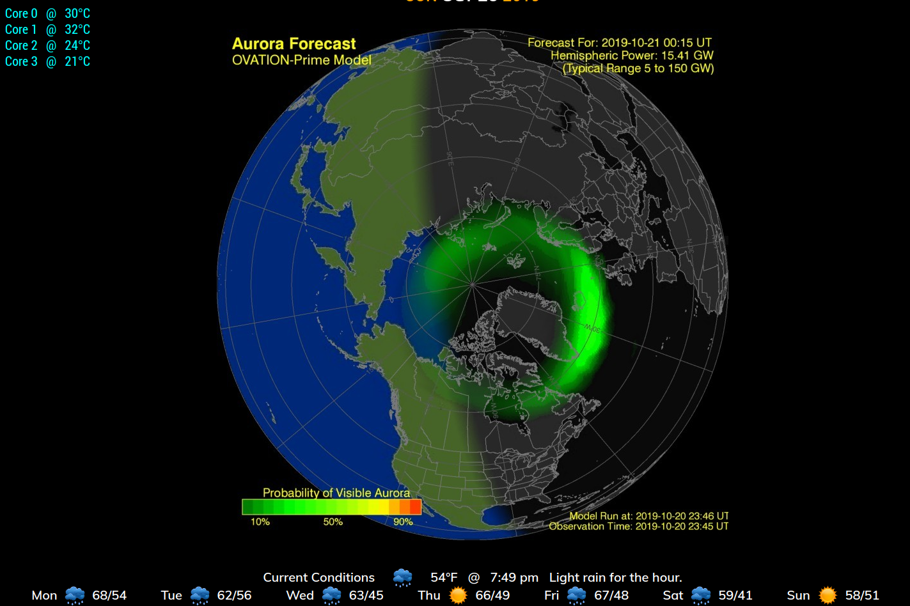
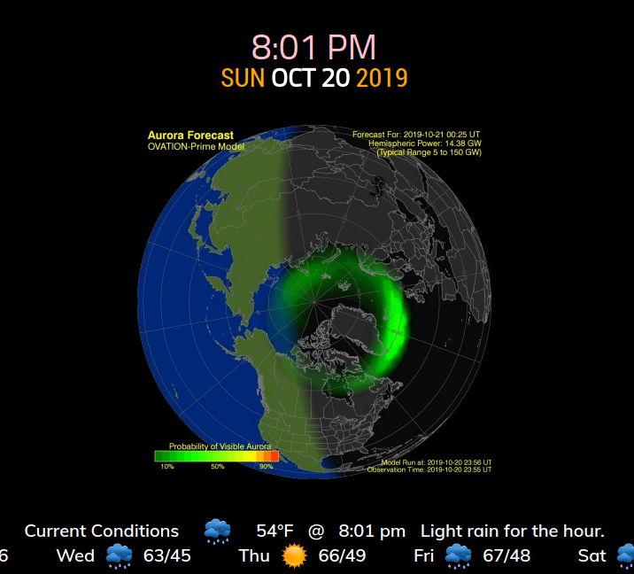

## MMM-Aurora

Graphic prediction for best viewing of Aurora Australis or Aurora Borealis.

Image source updates about every 10 minutes.

## Examples

, 

## Installation

* `git clone https://github.com/mykle1/MMM-Aurora.git` into the `~/MagicMirror/modules` directory.
* No dependencies!

## Config.js entry and options

```
{
    disabled: false,
    module: 'MMM-Aurora',
    position: 'bottom_center',
    config: {
        pole: "north", // north, south, solar, coronal or sunX.
        maxWidth: "100%", // Adjusts size of image
        updateInterval: 5 * 60 * 1000, // Image source updates about every 10 minutes
        animationSpeed: 3000 // fade in/out speed. 0 = no fade in/out
  }
},
```

### Special thanks to @chassain 0

For his addition of solar, coronal and sunX options.
